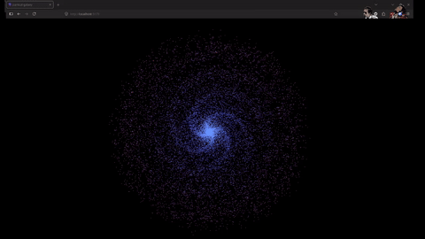
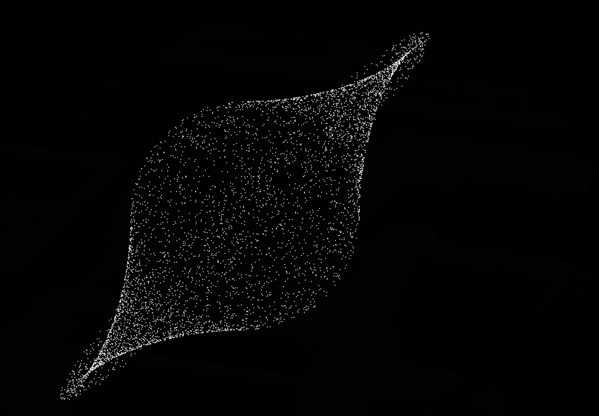

# Particle Galaxy

A procedural particle simulation project exploring the creation of spiral galaxies using TypeScript and HTML5 Canvas. This is a learning project focused on mathematical visualizations and efficient particle rendering.




## Technical Stack

- **Language:** TypeScript
- **Bundler:** Vite
- **Rendering:** HTML5 Canvas API

## Mathematical Foundations

The simulation uses several mathematical concepts to create the organic look of a spiral galaxy:

### 1. Particle Distribution
To create the spiral arms, particles are distributed based on a combination of radial and angular coordinates:
- **Radial Power:** `radius = Math.pow(Math.random(), 2) * 450`. Squaring the random value ensures a higher density of stars towards the galactic center, mimicking real stellar distributions.
- **Spiral Formula:** `angle = baseAngle + radius * 0.015`. The angle increases linearly with the radius, creating the characteristic "winding" effect of spiral arms.
- **Gaussian Noise:** Random offsets are added to both position and angle to create a more natural, less rigid appearance.

### 2. Coordinate Transformation (Rotation)
The rotation of the entire galaxy is calculated using a 2D rotation matrix:
- `rotatedX = x * cos(θ) - y * sin(θ)`
- `rotatedY = x * sin(θ) + y * cos(θ)`

### 3. Dynamic Coloring
Colors are mapped to the distance from the center using HSL:
- `hue = 220 + distance * 0.2`
- This creates a smooth gradient from deep blues at the core to lighter violets at the edges.

## Experiments & Patterns

During development, many experimental patterns were discovered by tweaking the force and distribution constants. Some of the patterns observed included:
- **Nebular Clouds:** Created by increasing the spread of particles and reducing the spiral intensity.
- **Ring Galaxies:** Formed when the radial distribution was constrained to a specific range.
- **Gravity Wells:** (Commented in the code) Experiments with inverse-square law attraction points that created dense, swirling clusters.

## Getting Started

```bash
# Install dependencies
npm install

# Run development server
npm run dev

# Build for production
npm run build
```
